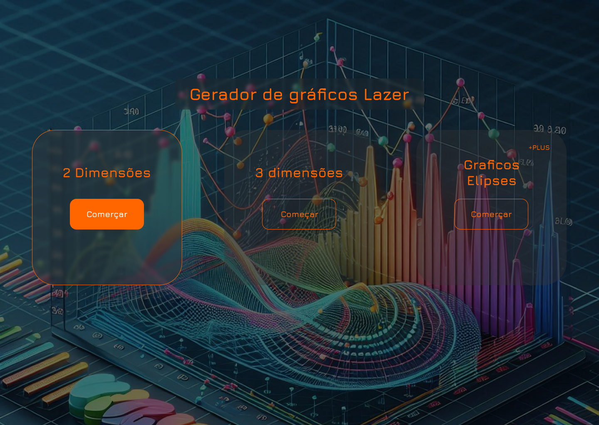

<h2>Welcome to the Two Beam interference pattern Project! 😊</h2>
<p>
This is a project built with Flask, aimed at generating graphs based on equations formed by two lasers. These lasers, pointed at the same point, project a specific object.
</p>


<p>
  The following screen corresponds to the 2D graph generator.
</p>


<p>
  The following screen corresponds to the 3D graph generator.
</p>

<hr/>
<h2>How to Use</h2>
<p>To use the program, you need to have Flask (a Python library) installed.</p>

```
pip install flask
```
<p>Start the application with:</p>

```
python app.py
```


